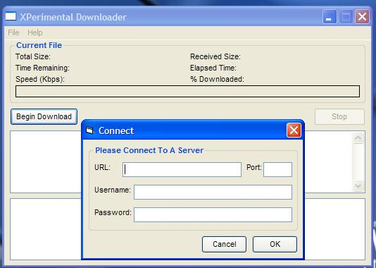



## XPerimental Downloader

### Description

Thanks for checking out my downloader. It includes resume support for HTTP & FTP. With redirectional and username/password functionality. I'm releasing this as opensource because there are very few (actually none that I could find) programs like this which aren't either massivly bloated or buggy. I hope this changes all that :) Thanks to vbip.com which with many of its tips helped me through, as well as many pieces of source on PSC. This makes use of the Windows XP interface while still being compatible with Windows 95,98,ME,NT4,2000! Please vote and leave your comments, thanks!
 
### More Info
 

             |
---                |---
**Submitted On**   |2001-10-31 20:24:44
**By**             |[Sukhjinder Sidhu](https://github.com/Planet-Source-Code/PSCIndex/blob/master/ByAuthor/sukhjinder-sidhu.md)
**Level**          |Advanced
**User Rating**    |4.6 (37 globes from 8 users)
**Compatibility**  |VB 5\.0, VB 6\.0
**Category**       |[Internet/ HTML](https://github.com/Planet-Source-Code/PSCIndex/blob/master/ByCategory/internet-html__1-34.md)
**World**          |[Visual Basic](https://github.com/Planet-Source-Code/PSCIndex/blob/master/ByWorld/visual-basic.md)
**Archive File**   |[XPerimenta3231610312001\.zip](https://github.com/Planet-Source-Code/sukhjinder-sidhu-xperimental-downloader__1-28554/archive/master.zip)

